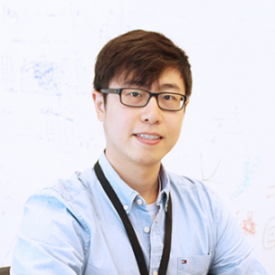

<title>Mengye Ren</title>

&nbsp;

<h1>Mengye Ren</h1>

Assistant Professor
 
Department of Computer Science
 
Courant Institute of Mathematical Sciences
 
Center for Data Science (joint)
 
New York University

Email: mengye@nyu.edu
 Tel: +1 (212) 998-3369
 Office: 60 5th Ave, Rm 508, New York, NY, 10011

<a href="https://www.linkedin.com/in/mengye-ren-593b3546">LinkedIn</a>&nbsp;
<a href="https://twitter.com/mengyer">Twitter</a>&nbsp;
<!-- <a href="https://github.com/renmengye">GitHub</a>&nbsp; -->
<a href="https://www.youtube.com/@mengyetalks">YouTube</a>&nbsp;
<!-- <a href="https://mengyeren.substack.com">Substack</a>&nbsp; -->
<a href="https://scholar.google.com/citations?user=XcQ9WqMAAAAJ">Google
Scholar</a>&nbsp;
<a href="cv/cv_mengye_ren.pdf">CV</a>&nbsp;
<!-- <a href="http://blog.mengyer.com">Blog</a> -->

-------------------------------------------------------------------------------

<a href="#bio">Bio</a> |
<a href="#research">Research</a> |
<a href="#teaching">Teaching</a> |
<a href="#news">News</a> |
<a href="#group">Group</a> |
<!-- <a href="#preprints">Preprints</a> | -->
<a href="#papers">Papers</a> |
<a href="#talks">Talks</a>

-------------------------------------------------------------------------------

## <a name="bio">Bio</a>

Mengye Ren is an assistant professor of computer science and data science at
New York University (NYU). Before joining NYU, he was a visiting faculty
researcher at Google Brain Toronto working with Prof. [Geoffrey
Hinton](https://www.cs.toronto.edu/~hinton/). He received B.A.Sc. in
Engineering Science (2015), and M.Sc. (2017) and Ph.D. (2022) in Computer
Science from the University of Toronto, advised by Prof. [Richard
Zemel](http://www.cs.toronto.edu/~zemel/) and Prof. [Raquel
Urtasun](http://www.cs.toronto.edu/~urtasun/). From 2017 to 2021, he was also a
senior research scientist at Uber Advanced Technologies Group (ATG) and Waabi,
working on self-driving vehicles. His research focuses on making machine
learning more natural and human-like, in order for AIs to continually learn,
adapt, and reason in naturalistic environments.

-------------------------------------------------------------------------------

## <a name="research">Research</a>

Areas: machine learning, computer vision, representation learning,
meta-learning, few-shot learning, brain & cognitively inspired learning, robot
learning, self-driving vehicles

My key research question is: how do we enable human-like, agent-based machine
intelligence to continually learn, adapt, and reason in naturalistic
environments? I am interested in the emergence of intelligence by learning from
a point-of-view experience. Current research topics in my group are:

* Memorization and forgetting in sequentially changing environments

* Visual representation learning in the wild using egocentric videos

* Few-shot learning, reasoning, and abstraction in vision and language

* Human-AI alignment in personalized AI

<!-- Towards this goal of building a more general and flexible AI, my
research has centered on developing *representation learning* and
*meta-learning* algorithms. -->

<!-- Some recent research highlights include:

* Naturalistic paradigms for learning representations, classes, and attributes
  in an online continual data stream and very few labeled examples (few-shot 
  learning FSL): 
  [semi-supervised FSL](https://arxiv.org/abs/1803.00676), 
  [incremental FSL](https://arxiv.org/abs/1810.07218), 
  [online contextualized FSL](https://arxiv.org/abs/2007.04546),
  [attribute FSL](https://arxiv.org/abs/2012.05895),
  [online self-supervised learning](https://arxiv.org/abs/2109.05675)

* Meta-learning algorithms:
  [contextual prototypical memory](https://arxiv.org/abs/2007.04546),
  [unsupervised prototypical memory](https://arxiv.org/abs/2109.05675),
  [learning regularization functions](https://arxiv.org/abs/1810.07218),
  [learning to reweight examples](https://arxiv.org/abs/1803.09050),
  [graph hypernetworks](https://arxiv.org/abs/1810.05749)

* Brain and cognitively inspired representation learning:
  [local activity perturbation](https://arxiv.org/abs/2210.03310),
  [local self-supervised learning](https://arxiv.org/abs/2008.01342),
  [self-supervised learning from video](https://arxiv.org/abs/2101.06553),
  [recurrent attention](https://arxiv.org/abs/1605.09410),
  [learning to imitate drawing](https://arxiv.org/abs/2009.04806),
  [divisive normalization](https://arxiv.org/abs/1611.04520) -->

-------------------------------------------------------------------------------

## <a name="teaching">Teaching</a>

* NYU DS-GA 1008 / CSCI-GA 2572: Deep Learning [[2024 spring](https://drive.google.com/drive/folders/12OMYhwWql5EH_jOrmqI3j2QY9GjNLX6N?usp=sharing)]

* NYU CSCI-GA 2565: Machine Learning [[2023 fall](https://nyu-cs2565.github.io/2023-fall)]

* NYU DS-GA 1003: Machine Learning [[2023 spring](https://nyu-ds1003.github.io/spring2023)]

* Vector Institute: Deep Learning II [2020 fall]

* UofT CSC 411: Machine Learning and Data Mining 
[[2019 winter](https://www.cs.toronto.edu/~mren/teach/csc411_19s/)]

-------------------------------------------------------------------------------

## <a name="news">News</a>

* 2024/07: One [paper](https://arxiv.org/abs/2403.15362) is accepted at COLM 2024.

* 2024/07: One paper is accepted at ECCV 2024.

* 2024/05: One [paper](https://arxiv.org/abs/2312.12736) is accepted at ICML 2024.

* 2024/04: Congrats [Chris Hoang](https://2016choang.github.io/) on receiving the [2024 DoD NDSEG fellowship](https://ndseg.sysplus.com/NDSEG/Awardees/FY2024)!

* 2024/04: I will give an invited [talk](https://www.simonsfoundation.org/event/machine-learning-at-the-flatiron-institute-seminar-mengye-ren/) at Flatiron Institute in New York.

* 2024/04: One [paper](https://arxiv.org/pdf/2404.19132) is accepted at CoLLAs 2024.

* 2024/04: One [paper](https://arxiv.org/abs/2402.00300) is accepted at CogSci 2024.

* 2024/04: I gave an invited [talk](https://www.northamerica.uaruhr.de/nyc/events/2024/event00228.html.en) at the German Consulate General in New York.

* 2023/09: Congrats [Alex Wang](https://alexnwang.github.io/) on getting the NSERC PGS-D award!

* 2023/06: I am co-organizing [Localized Learning Workshop](https://sites.google.com/view/localized-learning-workshop) at ICML 2023.

* 2023/04: One [paper](research/2023/multitask-learning-via-interleaving-a-neural-network-investigation/mayo-2023-multitask.pdf) is accepted at CogSci 2023.

* 2023/02: One [paper](https://arxiv.org/abs/2311.02007) is accepted at CVPR 2023.

* 2023/01: Two papers [[1](https://arxiv.org/abs/2210.03310), [2](research/2023/learning-in-temporally-structured-environments/jones-2023-learning.pdf)] are accepted at ICLR 2023.

<!-- * 2022/12: I gave an invited [talk](https://youtu.be/bYZ_lO8nNf0) at NeurIPS 2022 Meta-Learn workshop.

* 2022/10: New [preprint](https://arxiv.org/abs/2210.03310) on biologically
  plausible learning with local activity perturbation.

* 2022/10: One [paper](https://arxiv.org/abs/2210.02615) is accepted at MATH-AI workshop at NeurIPS.

* 2022/10: One [paper](research/2022/neural-network-online-training-with-sensitivity-to-multiscale-temporal-structure/jones-2022-neural.pdf) is accepted at MemARI workshop at NeurIPS.

* 2022/09: I have moved to New York and officially joined NYU. -->

<!-- * 2022/07: One [paper](https://www.ecva.net/papers/eccv_2022/papers_ECCV/papers/136990259.pdf) accepted at ECCV 2022.

* 2022/01: I started working at Google Brain Toronto as a visiting faculty researcher.

* 2021/11: I will visit the University of Oxford and give a talk on Nov 17, 2021.

* 2021/10: I will visit Stanford University and give a talk on Oct 20, 2021.

* 2021/10: I defended my Ph.D. thesis ["Open World Machine Learning with
  Limited Labeled
  Data"](https://tspace.library.utoronto.ca/bitstream/1807/123215/2/Ren_Mengye_202206_PhD_thesis.pdf)
  on Oct 19, 2021.

* 2021/09: Two papers [[1](https://arxiv.org/abs/2104.03956),
  [2](https://arxiv.org/abs/2101.06784)] are accepted at CoRL 2021.

* 2021/07: Two papers [[1](https://arxiv.org/abs/2101.06553),
  [2](https://arxiv.org/abs/2101.06560)] are accepted at ICCV 2021.

* 2021/05: I will join as an assistant professor at [NYU Courant Computer
  Science](https://cs.nyu.edu/home/index.html) and [Center for Data
  Science](https://cds.nyu.edu) starting Sept 2022.

* 2021/05: One [paper](https://arxiv.org/abs/2009.04806) is accepted at ICML 2021.

* 2021/02: Two papers [[1](https://arxiv.org/abs/2101.06549),
  [2](https://arxiv.org/abs/2101.06541)] are accepted at CVPR 2021.

* 2021/02: One [paper](https://arxiv.org/abs/2011.01153) is accepted at ICRA 2021.

* 2021/01: Two papers [[1](https://arxiv.org/abs/2007.04546),
  [2](https://arxiv.org/abs/2010.07140)] are accepted at ICLR 2021.

* 2020/10: One [paper](https://arxiv.org/abs/2011.05289) is accepted at CoRL 2020.

* 2020/09: One [paper](https://arxiv.org/abs/2008.01342) is accepted at NeurIPS 2020.

* 2020/09: I will visit Stanford University and give a talk on Oct 12, 2020.

* 2020/09: I will visit Brown University and give a talk on Sept 25, 2020.

* 2020/08: I will visit [MIT](https://sites.google.com/view/visionseminar) and
  give a talk on Sept 22, 2020.

* 2020/08: I will give a talk at [Mila](https://mila.quebec/en/cours/rdv) on
  Aug 28, 2020. -->

<!-- * 2020/07: One [paper](https://arxiv.org/abs/2008.05930) is accepted at ECCV 2020.

* 2020/07: One [paper](https://arxiv.org/abs/2008.05927) is accepted at IROS 2020.

* 2020/06: One [paper](https://arxiv.org/abs/2007.05096) is accepted at ICML 2020.

* 2020/02: One [paper](https://arxiv.org/abs/2004.00543) is accepted at CVPR 2020.

* 2019/09: One [paper](https://arxiv.org/abs/1910.11296) is accepted at CoRL 2019.

* 2019/09: One [paper](https://arxiv.org/abs/1810.07218) is accepted at NeurIPS 2019.

* 2019/09: I will visit [Columbia University](http://stat.columbia.edu/student-seminar-fall-2019) in
  NYC on Oct 9, 2019.

* 2019/06: One [paper](https://arxiv.org/abs/1910.04586) is accepted at IROS 2019.

* 2018/12: One [paper](https://arxiv.org/abs/1810.05749) is accepted at ICLR 2019.

* 2018/10: I will be teaching CSC 411 (Machine Learning and Data Mining) in the winter semester of 2019. [[course website](teach/csc411_19s)]

* 2018/06: I will visit INRIA Grenoble Rhône-Alpes and give a talk on July 19, 2018.

* 2018/06: I will visit TU Berlin on July 16, 2018.

* 2018/05: I will visit NEC lab in Princeton, NJ and give a talk on June 4, 2018.

* 2018/04: I will visit the University of Tübingen and MPI for Intelligent Systems from June 25 to
  July 20, 2018.
 -->

----------------------------------------------------------------------------

## <a name="group">Group</a>

* [Chris Hoang](https://2016choang.github.io/) (2023-)
* [Jack Lu](https://jacklu0831.github.io/) (2023-)
* [Ryan Teehan](https://rteehas.github.io/) (2022-)
* [Alex Wang](https://alexnwang.github.io/) (2022-)
* [Yanlai Yang](https://yanlai00.github.io/) (2022-)

----------------------------------------------------------------------------

## <a name="papers">Recent Papers</a>
[[Full List](research)]
[[Google Scholar](https://scholar.google.com/citations?user=XcQ9WqMAAAAJ)]
[[dblp](https://dblp.org/pers/hd/r/Ren:Mengye)]

* [Integrating present and past in unsupervised continual learning](https://arxiv.org/abs/2404.19132).
Yipeng Zhang, Laurent Charlin, Richard Zemel, Mengye Ren.
*arXiv preprint 2404.19132*, 2024.
[[arxiv](https://arxiv.org/abs/2404.19132)]

* [CoLLEGe: Concept embedding generation for large language models](https://arxiv.org/abs/2403.15362).
Ryan Teehan, Brenden M. Lake, Mengye Ren.
*arXiv preprint 2403.15362*, 2024.
[[arxiv](https://arxiv.org/abs/2403.15362)]

* [Reawakening knowledge: Anticipatory recovery from catastrophic interference via structured training](https://arxiv.org/abs/2403.09613).
Yanlai Yang, Matt Jones, Michael C. Mozer, Mengye Ren.
*arXiv preprint 2403.09613*, 2024.
[[arxiv](https://arxiv.org/abs/2403.09613)]

* [Self-supervised learning of video representations from a child's perspective](https://arxiv.org/abs/2402.00300).
Emin Orhan, Wentao Wang, Alex N. Wang, Mengye Ren, Brenden M. Lake.
*arXiv preprint 2402.00300*, 2024.
[[arxiv](https://arxiv.org/abs/2402.00300)]

* [Learning and forgetting unsafe examples in large language models](https://arxiv.org/abs/2312.12736).
Jiachen Zhao, Zhun Deng, David Madras, James Zou, Mengye Ren.
*arXiv preprint 2312.12736*, 2023.
[[arxiv](https://arxiv.org/abs/2312.12736)]

* [LifelongMemory: Leveraging LLMs for answering queries in long-form egocentric videos](https://arxiv.org/abs/2312.05269).
Ying Wang, Yanlai Yang, Mengye Ren.
*arXiv preprint 2312.05269*, 2023.
[[webpage](https://lifelongmemory.github.io/)]
[[arxiv](https://arxiv.org/abs/2312.05269)]

* [BIM: Block-wise self-supervised learning with masked image modeling](https://arxiv.org/abs/2311.17218).
Yixuan Luo, Mengye Ren, Sai Qian Zhang. 
*arXiv preprint 2311.17218*, 2023.
[[arxiv](https://arxiv.org/abs/2311.17218)]

* [Scaling forward gradient with local losses](research/2023/scaling-forward-gradient-with-local-losses).
Mengye Ren, Simon Kornblith, Renjie Liao, Geoffrey Hinton.
*ICLR*, 2023.
[[arxiv](https://arxiv.org/abs/2210.03310)]
[[pdf](research/2023/scaling-forward-gradient-with-local-losses/ren-2023-scaling.pdf)]
[[code](https://github.com/google-research/google-research/tree/master/local_forward_gradient)]
[[html](research/2023/scaling-forward-gradient-with-local-losses)]

* Learning in temporally structured environments.
Matt Jones, Tyler R. Scott, Mengye Ren, Gamaleldin F. Elsayed, Katherine Hermann, David Mayo, Michael C. Mozer.
*ICLR*, 2023.
[[pdf](2023/learning-in-temporally-structured-environments/jones-2023-learning.pdf)]

* Multitask learning via interleaving: A neural network investigation.
David Mayo, Tyler Scott, Mengye Ren, Gamaleldin Elsayed, Katherine Hermann, Matt Jones, Michael Mozer. *CogSci*, 2023.
[[pdf](2023/multitask-learning-via-interleaving-a-neural-network-investigation/mayo-2023-multitask.pdf)]

<!-- ----------------------------------------------------------------------------

## <a name="papers">Selected Papers</a>
[[Full List](research)]
[[Google Scholar](https://scholar.google.com/citations?user=XcQ9WqMAAAAJ)]
[[dblp](https://dblp.org/pers/hd/r/Ren:Mengye)]

* [Scaling forward gradient with local losses](research/2023/scaling-forward-gradient-with-local-losses).
Mengye Ren, Simon Kornblith, Renjie Liao, Geoffrey Hinton.
*ICLR*, 2023.
[[arxiv](https://arxiv.org/abs/2210.03310)]
[[pdf](research/2023/scaling-forward-gradient-with-local-losses/ren-2023-scaling.pdf)]
[[code](https://github.com/google-research/google-research/tree/master/local_forward_gradient)]
[[html](research/2023/scaling-forward-gradient-with-local-losses)]

* [Online unsupervised learning of visual representations and categories](research/2022/online-unsupervised-learning-of-visual-representations-and-categories).
Mengye Ren, Tyler R. Scott, Michael L. Iuzzolino, Michael C. Mozer, Richard Zemel.
*arXiv preprint 2109.05675*, 2022.
[[arxiv](https://arxiv.org/abs/2109.05675)]
[[pdf](research/2022/online-unsupervised-learning-of-visual-representations-and-categories/ren-2022-online.pdf)]
[[code](https://github.com/renmengye/online-unsup-proto-net)]
[[html](research/2022/online-unsupervised-learning-of-visual-representations-and-categories)]

* [Self-supervised representation learning from flow equivariance](research/2021/self-supervised-representation-learning-from-flow-equivariance).
Yuwen Xiong, Mengye Ren, Wenyuan Zeng, Raquel Urtasun.
*ICCV*, 2021.
[[arxiv](https://arxiv.org/abs/2101.06553)]
[[pdf](research/2021/self-supervised-representation-learning-from-flow-equivariance/xiong-2021-self.pdf)]
[[html](research/2021/self-supervised-representation-learning-from-flow-equivariance)]

* [SketchEmbedNet: Learning novel concepts by imitating drawings](research/2021/sketch-embed-net-learning-novel-concepts-by-imitating-drawings).
Alexander Wang``*``, Mengye Ren``*``, Richard Zemel.
*ICML*, 2021.
[[arxiv](https://arxiv.org/abs/2009.04806)]
[[pdf](research/2021/sketch-embed-net-learning-novel-concepts-by-imitating-drawings/wang-2021-sketch.pdf)]
[[code](https://github.com/alexnwang/SketchEmbedNet-public)]
[[html](research/2021/sketch-embed-net-learning-novel-concepts-by-imitating-drawings)]

* [Wandering within a world: Online contextualized few-shot learning](research/2021/wandering-within-a-world-online-contextualized-few-shot-learning).
Mengye Ren, Michael L. Iuzzolino, Michael C. Mozer, Richard Zemel.
*ICLR*, 2021.
[[arxiv](https://arxiv.org/abs/2007.04546)]
[[pdf](research/2021/wandering-within-a-world-online-contextualized-few-shot-learning/ren-2021-wandering.pdf)]
[[code](https://github.com/renmengye/oc-fewshot-public)]
[[video](https://slideslive.com/38931573/wandering-within-a-world-online-contextualized-fewshot-learning)]
[[html](research/2021/wandering-within-a-world-online-contextualized-few-shot-learning)]

* [Probing few-shot generalization with attributes](research/2020/probing-few-shot-generalization-with-attributes).
Mengye Ren``*``, Eleni Triantafillou``*``, Kuan-Chieh Wang``*``, James Lucas``*``, Jake Snell, Xaq Pitkow, Andreas S. Tolias, Richard Zemel.
*arXiv preprint 2012.05895*, 2020.
[[arxiv](https://arxiv.org/abs/2012.05895)]
[[pdf](2022/probing-few-shot-generalization-with-attributes/ren-2022-probing.pdf)]
[[video](https://slideslive.at/38941548/flexible-fewshot-learning-of-contextual-similarities)]
[[html](research/2022/probing-few-shot-generalization-with-attributes)]

* [LoCo: Local contrastive representation learning](research/2020/loco-local-contrastive-representation-learning).
Yuwen Xiong, Mengye Ren, Raquel Urtasun.
*NeurIPS*, 2020.
[[arxiv](https://arxiv.org/abs/2008.01342)]
[[pdf](research/2020/loco-local-contrastive-representation-learning/xiong-2020-loco.pdf)]
[[video](https://slideslive.com/38936405/loco-local-contrastive-representation-learning)]
[[html](research/2020/loco-local-contrastive-representation-learning)]

* [Multi-agent routing value iteration network](research/2020/multi-agent-routing-value-iteration-network).
Quinlan Sykora``*``, Mengye Ren``*``, Raquel Urtasun.
*ICML*, 2020.
[[arxiv](https://arxiv.org/abs/2007.05096)]
[[pdf](research/2020/multi-agent-routing-value-iteration-network/sykora-2020-multi.pdf)]
[[code](https://github.com/uber-research/MARVIN)]
[[video](https://slideslive.com/38927801/multiagent-routing-value-iteration-network-marvin)]
[[html](research/2020/multi-agent-routing-value-iteration-network)]

* [Incremental few-shot learning with attention attractor networks](research/2019/incremental-few-shot-learning-with-attention-attractor-networks).
Mengye Ren, Renjie Liao, Ethan Fetaya, Richard S. Zemel.
*NeurIPS*, 2019.
[[arxiv](https://arxiv.org/abs/1810.07218)]
[[code](https://github.com/renmengye/inc-few-shot-attractor-public)]
[[html](research/2019/incremental-few-shot-learning-with-attention-attractor-networks)]

* [Graph hypernetworks for neural architecture search](research/2019/graph-hypernetworks-for-neural-architecture-search).
Chris Zhang, Mengye Ren, Raquel Urtasun.
*ICLR*, 2019.
[[arxiv](https://arxiv.org/abs/1810.05749)]
[[html](research/2019/graph-hypernetworks-for-neural-architecture-search)]

* [Learning to reweight examples for robust deep learning](research/2018/learning-to-reweight-examples-for-robust-deep-learning).
Mengye Ren, Wenyuan Zeng, Bin Yang, Raquel Urtasun.
*ICML*, 2018.
[[arxiv](https://arxiv.org/abs/1803.09050)]
[[code](https://github.com/uber-research/learning-to-reweight-examples)]
[[video](https://vimeo.com/287808016)]
[[html](research/2018/learning-to-reweight-examples-for-robust-deep-learning)]

* [Meta-learning for semi-supervised few-shot classification](research/2018/meta-learning-for-semi-supervised-few-shot-classification).
Mengye Ren, Eleni Triantafillou``*``, Sachin Ravi``*``, Jake Snell, Kevin
Swersky, Joshua B. Tenenbaum, Hugo Larochelle, Richard S. Zemel.
*ICLR*, 2018.
[[link](research/fewshotssl/index.html)]
[[arxiv](https://arxiv.org/abs/1803.00676)]
[[code](https://github.com/renmengye/few-shot-ssl-public)]
[[html](research/2018/meta-learning-for-semi-supervised-few-shot-classification)]

* [End-to-end instance segmentation with recurrent attention](https://arxiv.org/abs/1605.09410).
Mengye Ren, Richard S. Zemel.
*CVPR*, 2017.
[[link](research/recattend/index.html)]
[[arxiv](https://arxiv.org/abs/1605.09410)]
[[code](https://github.com/renmengye/rec-attend-public)]
[[video](https://www.youtube.com/watch?v=oHgUowLph7E)]

* [Exploring models and data for image question answering](https://arxiv.org/abs/1505.02074).
Mengye Ren, Ryan Kiros, Richard S. Zemel.
*NIPS*, 2015.
[[link](research/imageqa/index.html)]
[[arxiv](https://arxiv.org/abs/1505.02074)]
[[results](research/imageqa/results)]
[[dataset](research/imageqa/data/cocoqa)]
[[code](https://github.com/renmengye/imageqa-public)]
[[question generation](https://github.com/renmengye/imageqa-qgen)]
 -->

-------------------------------------------------------------------------------

## <a name="talks">Recent Talks</a>

[[Full List](talks)]

* Lifelong and human-like learning in foundation models.
    * Flatiron Institute. New York, NY, USA. 2024/04.
    [[slides](https://drive.google.com/file/d/1r2veZmRrQb3QI29m446e9QDjeR-cILl8/view?usp=sharing)]
    * German Consulate General in New York. New York, NY, USA. 2024/04.
    [[slides](https://drive.google.com/file/d/1kg_jqdLS1ztTcwEn9Oe235xIjULPN7G2/view?usp=sharing)]
    * American Statistical Association. Statistical Learning and Data Science Webinar. 2023/10.
    [[slides](https://drive.google.com/file/d/11vaeustbBEDfFpc9LH_M2Ke3M6UJuJ68/view?usp=sharing)]
    [[video](https://youtu.be/XRro25Am0JE)]

* Visual learning in the open world.
    * NeurIPS 2022 MetaLearn. New Orleans, LA, USA. 2022/12.
    [[slides](https://drive.google.com/file/d/1gA968oKiO1ufAtX3ogGsQbqJVkW0ztry/view?usp=sharing)]
    [[video](https://youtu.be/bYZ_lO8nNf0)]
    * University of Oxford. Oxford, UK. 2021/11.
    [[slides](https://drive.google.com/file/d/10_vWl_ETc_dNXFNcyt6Ft-4uvRyxaLAM/view?usp=sharing)]
    * Google Brain. Toronto, ON, Canada. 2021/11.
    [[slides](https://drive.google.com/file/d/10AQdRPe6va2-FxCrPM3bhqKW3FMRvMHU/view?usp=sharing)]
    * Stanford University. Stanford, CA, USA. 2021/10.
    [[slides](https://drive.google.com/file/d/10-WWd-GQ3Udf_IL_d6TIlq738tj_MKtt/view?usp=sharing)]

<!-- * Towards continual and compositional few-shot learning.
    * Stanford University. Stanford, CA, USA. 2020/10.
    [[slides](https://drive.google.com/file/d/1Y8jXp0wTlWqn9pBE97btRJX7FutQOqP1/view?usp=sharing)]
    * Brown University. Providence, RI, USA. 2020/09.
    [[slides](https://drive.google.com/file/d/1GjiRkDnMol3PdoxLKb5q7Oy4rDMnC0kT/view?usp=sharing)]
    * MIT. Cambridge, MA, USA. 2020/09.
    [[slides](https://drive.google.com/file/d/16GXux_cX6AahqQ2yLQIWtEP8AdpDKezA/view?usp=sharing)]
    [[video](https://www.youtube.com/watch?v=PhKBAkINm40)]
    * Mila. Montréal, QC, Canada. 2020/08.
    [[slides](https://drive.google.com/file/d/1LNXPTJEPhzK-wNPJrev-9EaButZrYRfr/view?usp=sharing)]

* Meta-learning for more human-like learning algorithms.
    * Columbia University. New York, NY, USA. 2019/10.
    [[slides](https://drive.google.com/file/d/1S6HgdAMx8_QYz5hcSf4B7tj_ZzwDd1t_/view?usp=sharing)]
    * INRIA Grenoble Rhône-Alpes. Grenoble, France. 2018/07.
    [[slides](https://drive.google.com/file/d/1ePaNOzThOL_F7B5SZPPNWpj2IkXcNdkE/view?usp=sharing)]
    * Max Planck Institute for Intelligent Systems. Tübingen, Germany. 2018/06.
    [[slides](https://drive.google.com/file/d/1nUqYGh1QKv5eyXsEStBo4bf5pQRbhFsF/view?usp=sharing)]
    * NEC Laboratories America. Princeton, NJ, USA. 2018/06.
    [[slides](https://drive.google.com/file/d/14_H34NgmQ6NN8XJkn_lwK_awrypUdQvv/view?usp=sharing)]
 -->

