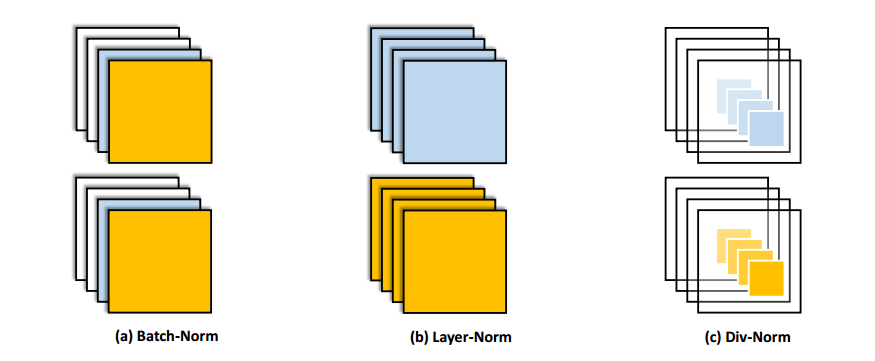

<title>Normalizing the Normalizers: Comparing and Extending Network Normalization Schemes</title>

<h1>Normalizing the Normalizers: Comparing and Extending Network Normalization Schemes</h1>

Mengye Ren``*`` 1, Renjie Liao``*`` 1, Raquel Urtasun1,
Fabian H. Sinz2, Richard S. Zemel1,3 
 
1Department of Computer Science, University of Toronto, Toronto ON, CANADA 
2Department of Neuroscience, Baylor College of Medicine, Houston TX, USA 
3Canadian Institute for Advanced Research, Toronto ON, CANADA 
``*``Equal contribution 
 

## Abstract
Normalization techniques have only recently begun to be exploited in supervised
learning tasks. Batch normalization exploits mini-batch statistics to normalize
the activations. This was shown to speed up training and result in better
models. However its success has been very limited when dealing with recurrent
neural networks. On the other hand, layer normalization normalizes the
activations across all activities within a layer. This was shown to work well in
the recurrent setting. In this paper we propose a unified view of normalization
techniques, as forms of divisive normalization, which includes layer and batch
normalization as special cases. Our second contribution is the finding that a
small modification to these normalization schemes, in conjunction with a sparse
regularizer on the activations, leads to significant benefits over standard
normalization techniques. We demonstrate the effectiveness of our unified
divisive normalization framework in the context of convolutional neural nets and
recurrent neural networks, showing improvements over baselines in image
classification, language modeling as well as super-resolution.

-------------------------------------------------------------------------------

## Full Paper
[[pdf](papers/paper.pdf)]

-------------------------------------------------------------------------------

## Poster
[[pdf](papers/poster.pdf)]

-------------------------------------------------------------------------------

## Code
[[link](https://github.com/renmengye/div-norm)]

-------------------------------------------------------------------------------

## Cite
<pre>
<code>
@inproceedings{ren17norm,
  author    = {Mengye Ren and Renjie Liao and Raquel Urtasun and 
               Fabian H. Sinz and Richard S. Zemel},
  title     = {Normalizing the Normalizers: Comparing and Extending Network 
               Normalization Schemes},
  booktitle = {ICLR},
  year      = {2017}
}
</code>
</pre>

