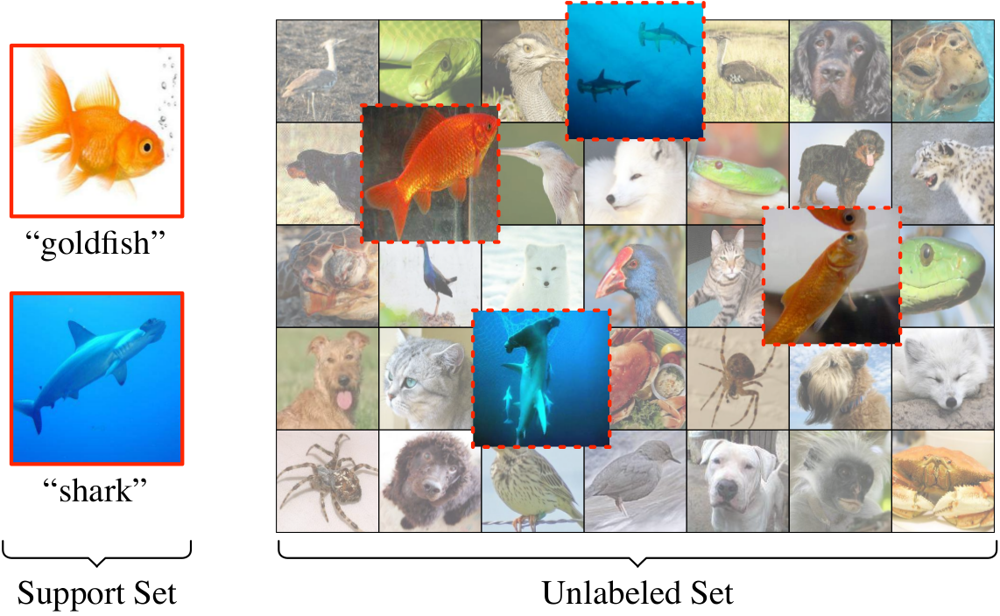

<title>Meta-Learning for Semi-Supervised Few-Shot Classification</title>

<h1>Meta-Learning for Semi-Supervised Few-Shot Classification</h1>

Mengye Ren1,6, Eleni Triantafilou``*``,1,6, Sachin Ravi``*``,2, 
Jake Snell1,6, Kevin Swersky3, Joshua B. Tenenbaum4, 
Hugo Larochelle3,5, Richard S. Zemel1,5,6 
 
1University of Toronto, 2Princeton University, 3Google Brain, 
4MIT, 5CIFAR, 6Vector Institute 
``*``Equal contribution 
 

## Abstract
In few-shot classification, we are interested in learning algorithms that train a classifier from
only a handful of labeled examples. Recent progress in few-shot classification has featured
meta-learning, in which a parameterized model for a learning algorithm is defined and trained on
episodes representing different classification problems, each with a small labeled training set and
its corresponding test set. In this work, we advance this few-shot classification paradigm towards a
scenario where unlabeled examples are also available within each episode. We consider two
situations: one where all unlabeled examples are assumed to belong to the same set of classes as the
labeled examples of the episode, as well as the more challenging situation where examples from other
distractor classes are also provided. To address this paradigm, we propose novel extensions of
Prototypical Networks (Snell et al., 2017) that are augmented with the ability to use unlabeled
examples when producing prototypes. These models are trained in an end-to-end way on episodes, to
learn to leverage the unlabeled examples successfully. We evaluate these methods on versions of the
Omniglot and miniImageNet benchmarks, adapted to this new framework augmented with unlabeled
examples. We also propose a new split of ImageNet, consisting of a large set of classes, with a
hierarchical structure. Our experiments confirm that our Prototypical Networks can learn to improve
their predictions due to unlabeled examples, much like a semi-supervised algorithm would.

-------------------------------------------------------------------------------

## Full Paper

[[pdf](papers/paper.pdf)]

-------------------------------------------------------------------------------

## Code and Datasets
[[link](https://github.com/renmengye/few-shot-ssl-public)]

-------------------------------------------------------------------------------

## Cite
<pre>
<code>
@inproceeding{ren18fewshotssl,
  author    = {Mengye Ren and 
               Eleni Triantafillou and 
               Sachin Ravi and 
               Jake Snell and 
               Kevin Swersky and 
               Joshua B. Tenenbaum and 
               Hugo Larochelle and 
               Richard S. Zemel},
  title     = {Meta-Learning for Semi-Supervised Few-Shot Classification},
  booktitle = {Proceedings of 6th International Conference on Learning 
               Representations, {ICLR}},
  year      = {2018},
}
</code>
</pre>

