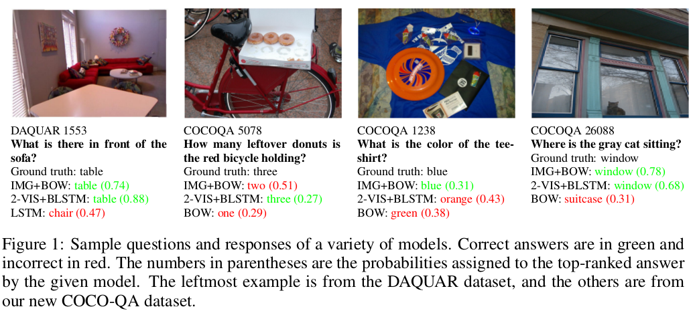
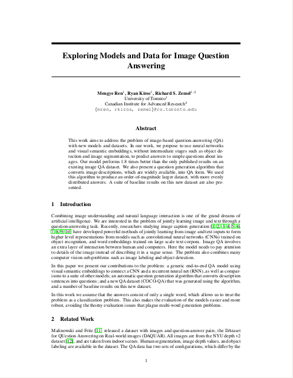
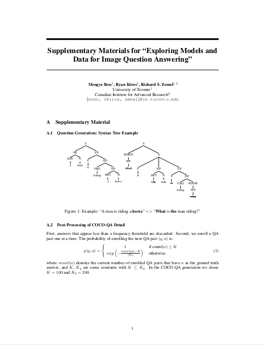

<title>Image Question Answering</title>

<h1>Exploring Models and Data for Image Question Answering</h1>

<!--

-->
Mengye Ren1, Ryan Kiros1, Richard S.
Zemel1,2 
 
1Department of Computer Science, University of Toronto, Toronto ON, CANADA 
2Canadian Institute for Advanced Research, Toronto ON, CANADA 
<!--

-->
 

## Abstract
This work aims to address the problem of image-based question-answering (QA)
with new models and datasets. In our work, we propose to use neural networks
and visual semantic embeddings, without intermediate stages such as object
detection and image segmentation, to predict answers to simple questions about
images. Our model performs 1.8 times better than the only published results on
an existing image QA dataset. We also present a question generation algorithm
that converts image descriptions, which are widely available, into QA form. We
used this algorithm to produce an order-of-magnitude larger dataset, with more
evenly distributed answers. A suite of baseline results on this new dataset are
also presented.

-------------------------------------------------------------------------------

## Full Paper
<!--  -->
[[pdf](papers/imageqa_nips2015.pdf)]

-------------------------------------------------------------------------------

## Supplementary Materials
<!--  -->
[[pdf](papers/imageqa_supplementary_nips2015.pdf)]

-------------------------------------------------------------------------------

## Dataset
[[link](data/cocoqa)]

-------------------------------------------------------------------------------

## Full results
[[link](results)]

-------------------------------------------------------------------------------

## Code
* To reproduce experimental results:
[[link](https://github.com/renmengye/imageqa-public)]
* To generate questions:
[[link](https://github.com/renmengye/imageqa-qgen)]

-------------------------------------------------------------------------------

## Cite
<pre>
<code>
@inproceedings{ren2015imageqa,
  title={Exploring Models and Data for Image Question Answering},
  author={Mengye Ren and Ryan Kiros and Richard Zemel},
  booktitle={NIPS},
  year={2015}
}
</code>
</pre>

