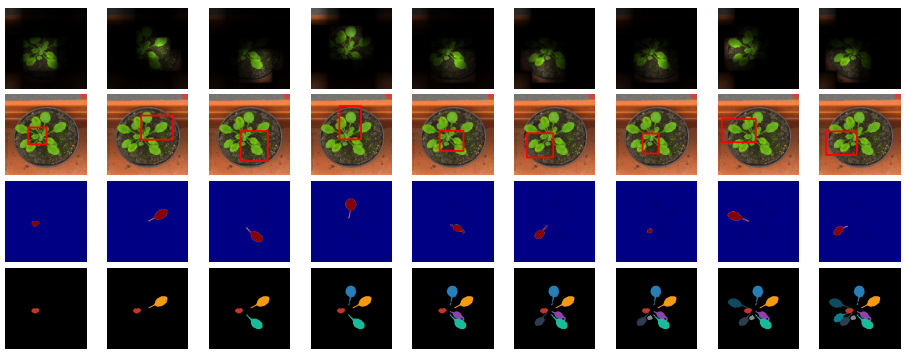

<title>End-to-End Instance Segmentation with Recurrent Attention</title>

<h1>End-to-End Instance Segmentation with Recurrent Attention</h1>

Mengye Ren1, Richard S. Zemel1,2 
 
1Department of Computer Science, University of Toronto, Toronto ON, CANADA 
2Canadian Institute for Advanced Research, Toronto ON, CANADA 
 

## Abstract
While convolutional neural networks have gained impressive success recently in
solving structured prediction problems such as semantic segmentation, it remains
a challenge to differentiate individual object instances in the scene. Instance
segmentation is very important in a variety of applications, such as autonomous
driving, image captioning, and visual question answering. Techniques that
combine large graphical models with low-level vision have been proposed to
address this problem; however,  we propose an end-to-end recurrent neural
network (RNN) architecture with an attention mechanism to model a human-like
counting process, and produce detailed instance segmentations. The network is
jointly trained to sequentially produce regions of interest as well as a
dominant object segmentation within each region. The proposed model achieves
competitive results on the CVPPP, KITTI, and Cityscapes datasets.

-------------------------------------------------------------------------------

## Full Paper

[[pdf](papers/paper.pdf)]

-------------------------------------------------------------------------------

## Supplementary Materials

[[pdf](papers/supplementary.pdf)]

-------------------------------------------------------------------------------

## Code
[[link](https://github.com/renmengye/recattend-public)]

-------------------------------------------------------------------------------

## Cite
<pre>
<code>
@inproceedings{ren17recattend,
  author    = {Mengye Ren and Richard S. Zemel},
  title     = {End-to-End Instance Segmentation with Recurrent Attention},
  booktitle = {CVPR},
  year      = {2017}
}
</code>
</pre>

