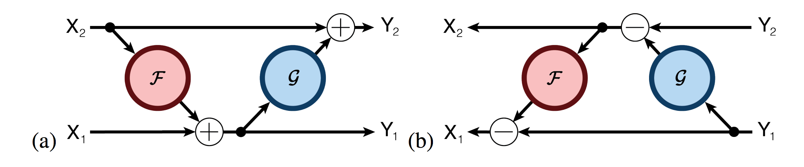

<title>The Reversible Residual Network: Backpropagation Without Storing
Activations</title>

<h1>The Reversible Residual Network: Backpropagation Without Storing
Activations</h1>

Aidan Gomez``*``, Mengye Ren``*``, Raquel Urtasun, Roger B. Grosse 
 
Department of Computer Science, University of Toronto, Toronto ON, CANADA 
``*``Equal contribution 
 

## Abstract
Deep residual networks (ResNets) have significantly pushed forward the
state-of-the-art on image classification, increasing in performance as networks
grow both deeper and wider. However, memory consumption becomes a bottleneck,
as one needs to store the activations in order to calculate gradients using
backpropagation. We present the Reversible Residual Network (RevNet), a variant
of ResNets where each layer's activations can be reconstructed exactly from the
next layer's. Therefore, the activations for most layers need not be stored in
memory during backpropagation. We demonstrate the effectiveness of RevNets on
CIFAR-10, CIFAR-100, and ImageNet, establishing nearly identical classification
accuracy to equally-sized ResNets, even though the activation storage
requirements are independent of depth.

-------------------------------------------------------------------------------

## Full Paper

[[pdf](papers/paper.pdf)]

-------------------------------------------------------------------------------

## Code
[[link](https://github.com/renmengye/revnet-public)]

-------------------------------------------------------------------------------

## Cite
<pre>
<code>
@inproceedings{gomez17revnet,
  author    = {Aidan N. Gomez and 
               Mengye Ren and 
               Raquel Urtasun and 
               Roger B. Grosse},
  title     = {The Reversible Residual Network: Backpropagation without 
               Storing Activations}
  booktitle = {NIPS},
  year      = {2017},
}
</code>
</pre>

