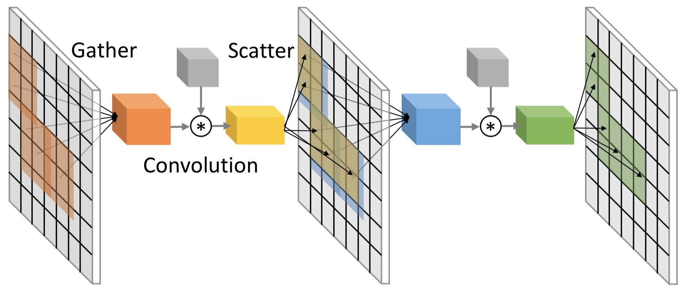

<title>SBNet: Sparse Blocks Network for Fast Inference</title>

<h1>SBNet: Sparse Blocks Network for Fast Inference</h1>

Mengye Ren``*``,1,2, Andrei Pokrovsky``*``,1, Bin Yang``*``,1,2, 
Raquel Urtasun1,2 
 
1Uber Advanced Technologies Group, Toronto ON, CANADA 
2Department of Computer Science, University of Toronto, Toronto ON, CANADA 
``*``Equal contribution 
 

## Abstract
Conventional deep convolutional neural networks (CNNs) apply convolution operators uniformly in
space across all feature maps for hundreds of layers - this incurs a high computational cost for
real time applications. For many problems such as object detection and semantic segmentation, we are
able to obtain a low-cost computation mask, either from a priori problem knowledge, or from a low
resolution segmentation network. We show that such computation masks can be used to reduce
computation in the high resolution main network. Variants of sparse activation CNNs have previously
been explored on small scale tasks, and showed no degradation in terms of object classification
accuracy, but often measured gains in terms of theoretical FLOPs without realizing a practical
speed-up when compared to highly optimized dense convolution implementations. In this work, we
leverage the sparsity structure of computation masks and propose a novel tiling-based sparse
convolution algorithm. We verified the effectiveness of our sparse CNN on LiDAR based 3D object
detection, and we report significant wall-clock speed-ups compared to dense convolution, as well as
improved detection accuracy.

-------------------------------------------------------------------------------

## Full Paper

[[pdf](papers/paper.pdf)]

-------------------------------------------------------------------------------

## Code
[[link](https://github.com/uber/sbnet)]

-------------------------------------------------------------------------------

## Cite
<pre>
<code>
@inproceeding{ren18sbnet,
  author    = {Mengye Ren and 
               Andrei Pokrovsky and
               Bin Yang and
               Raquel Urtasun},
  title     = {SBNet: Sparse Blocks Network for Fast Inference},
  journal   = {Proceedings of the 2018 IEEE Conference on Computer Vision 
               and Pattern Recognition, {CVPR}},
  year      = {2018},
}
</code>
</pre>

